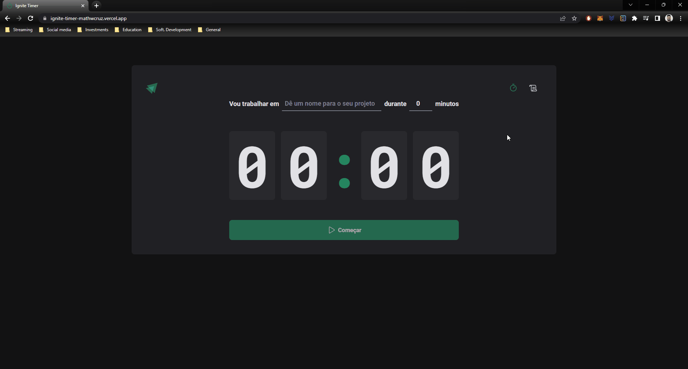

<h1 align="center">
  
</h1>

## <h2 align="center">[Front end application](https://ignite-timer-mathwcruz.vercel.app) 💻</h2>

<h3 align="center">Pomodoro app to register your cycles of work</h3>

  <a href="#computer-demonstration-of-the-application">Demonstration of the application</a>&nbsp;&nbsp;&nbsp;|&nbsp;&nbsp;&nbsp;
  <a href="#star-features">Features</a>&nbsp;&nbsp;&nbsp;|&nbsp;&nbsp;&nbsp;
  <a href="#rocket-technologies-used">Technologies used</a>&nbsp;&nbsp;&nbsp;|&nbsp;&nbsp;&nbsp;
  <a href="#information_source-application-installation">Application installation</a>

# :computer: Demonstration of the application

  

<h3 align="center"> 
	Application status: Finalized ✔️
</h3>

## :star: Features

- [x] Start a new cycle of work
- [x] Interrupt a cycle in progress
- [x] Visualize the history of all your cycles of work
- [x] Remove a cycle which was finished or interrupted

## :rocket: Technologies used:

## :information_source: Application installation

- `git clone https://github.com/mathwcruz/ignite-timer.git` to clone the repository

# 🎲 Run web application

To run the application on the web, follow the instructions from your terminal:

- `cd ignite-timer` and `code .`
- run `npm i` to install the dependencies of the project
- After that, run `npm run dev` to run the application, will open at the address `localhost:5173`

### Author

---

<a href="https://app.rocketseat.com.br/me/matheus-da-cruz-frontend">
 
  
 <b>Matheus da Cruz</b></a> <a href="https://app.rocketseat.com.br/me/matheus-da-cruz-frontend" title="Rocketseat">  🚀</a>

